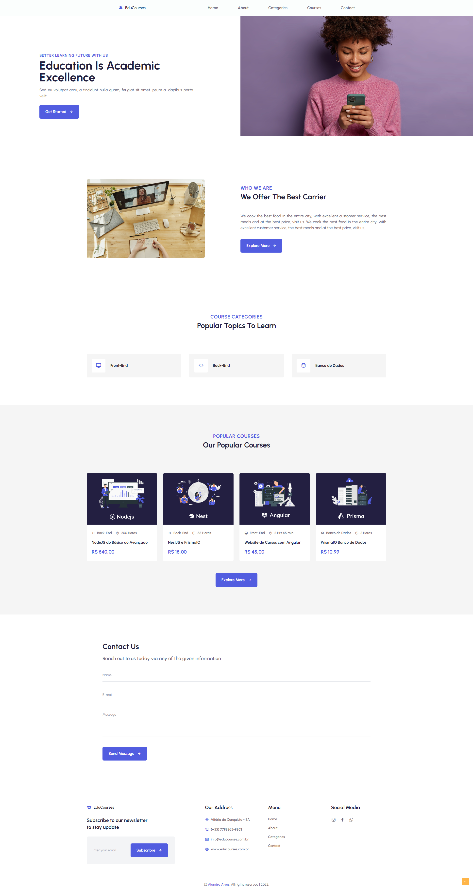

	

    

## 💻 Projeto

A <b>EduCourses</b> é um website de cursos online, aqui você pode encontrar diversos cursos da area de programação. Um simples website, para mostrar conceitos basicos de front-end e back-end.

## ✨ Tecnologias

Esse projeto foi desenvolvido com as seguintes tecnologias:

-   [Nestjs](https://docs.nestjs.com/)
-   [PrismaIO](https://www.prisma.io/)
-   [Angular](https://angular.io/)
-   [Tailwindcss](https://tailwindcss.com/)

## 🚀 Instalação e Configuração do <b>Backend</b>

1. Instale as Dependências: `npm install`

2. Execute as Migrations: `npx prisma migrate dev`

3. Execute a API: `npm run start:dev`

Por fim, a aplicação estará disponível em `http://localhost:3000`

---

## 🚀 Instalação do <b>Frontend</b>

1. Instale as Dependências: `npm install`

2. Execute o projeto: `ng serve`

Por fim, a aplicação estará disponível em `http://localhost:4200`

---

## 🚀 Instalação do <b>Web</b>

OBS: Disponibilizada na pasta "educourses".

1. Instale as Dependências: `npm install`

2. Execute o projeto: `npm run dev`

3. Caso você esteja utilizando o `VisualStudioCode`, instale a biblioteca do `Live Serve` e execute o `Go Live`, ele executara seu projeto sem que precise atualizar o servidor sempre que modificar o código do projeto.

---

Feito com ❤ por Aiandra Meira 👋🏻 &nbsp;[Portfólio Pessoal](http://www.aiandralves.com)
